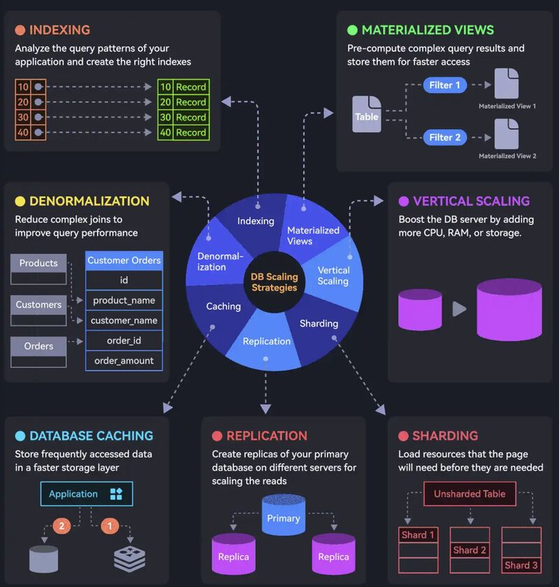

### 7 𝐊𝐞𝐲 𝐒𝐭𝐫𝐚𝐭𝐞𝐠𝐢𝐞𝐬 𝐭𝐨 𝐒𝐜𝐚𝐥𝐞 𝐃𝐚𝐭𝐚𝐛𝐚𝐬𝐞 𝐨𝐧 𝐂𝐥𝐨𝐮𝐝 𝐍𝐚𝐭𝐢𝐯𝐞 𝐏𝐥𝐚𝐭𝐟𝐨𝐫𝐦

Database Scaling is an important parameter with respect to data handling when application data read/write increases. 

These 7 simple strategies can effectively help in scaling DB effectively
  
-  𝑰𝒏𝒅𝒆𝒙𝒊𝒏𝒈: Checking the query patterns of the application and creating right indexes.
  
-  𝑴𝒂𝒕𝒆𝒓𝒊𝒂𝒍𝒊𝒛𝒆𝒅 𝑽𝒊𝒆𝒘𝒔: Pre-computing complex query results,storing them for faster access.
  
-  𝑫𝒆𝒏𝒐𝒓𝒎𝒂𝒍𝒊𝒛𝒂𝒕𝒊𝒐𝒏: Reducing complex joins to improve query performance.
  
-  𝑽𝒆𝒓𝒕𝒊𝒄𝒂𝒍 𝑺𝒄𝒂𝒍𝒊𝒏𝒈: Boost database server by adding more CPU, RAM, or storage.
  
-  𝑪𝒂𝒄𝒉𝒊𝒏𝒈: Storing frequently accessed data in a faster storage layer to reduce hashtag#database load.
  
-  𝑹𝒆𝒑𝒍𝒊𝒄𝒂𝒕𝒊𝒐𝒏: Creating replicas on the primary database on different servers for scaling the reads.
  
-  𝑺𝒉𝒂𝒓𝒅𝒊𝒏𝒈: Splitting database tables into smaller pieces and spreading them across servers. Used for scaling the writes as well as the reads.

What's your go-to strategy ?

