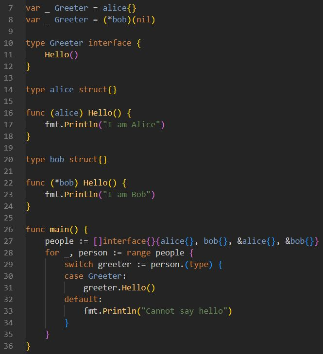

What does this Go code print?

The answer is

I am Alice
Cannot say hello
I am Alice
I am Bob

But why? This brings us to something called “method sets”. 
It can be a bit confusing because the Go spec provides only limited details on this topic https://go.dev/ref/spec#Method_sets.

If you want to know I recommend reading this article https://gronskiy.com/posts/2020-04-golang-pointer-vs-value-methods/ with a thorough explanation of Go's method sets and how pointers and values interact with methods and interfaces.
