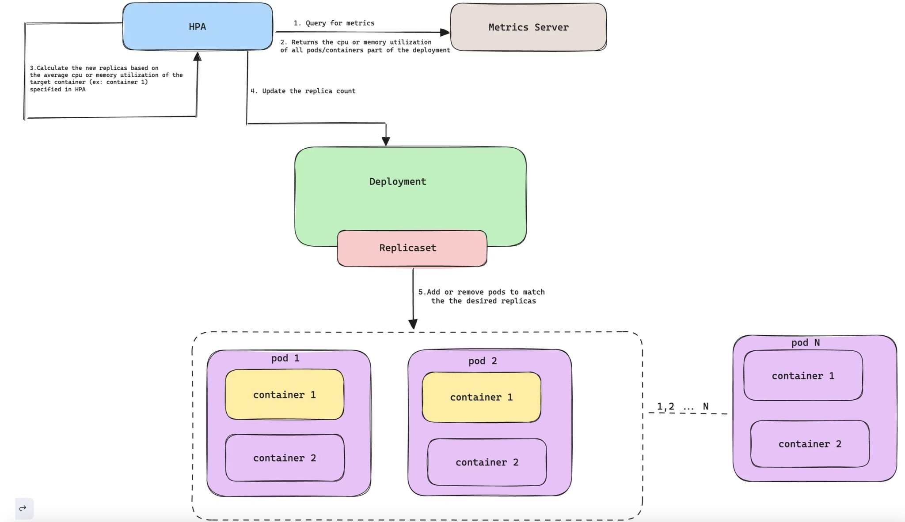

𝐂𝐨𝐧𝐭𝐫𝐨𝐥𝐥𝐢𝐧𝐠 𝐟𝐢𝐧𝐞-𝐠𝐫𝐚𝐢𝐧𝐞𝐝 𝐂𝐨𝐧𝐭𝐚𝐢𝐧𝐞𝐫 𝐌𝐞𝐭𝐫𝐢𝐜𝐬 𝐯𝐢𝐚 𝐊𝐮𝐛𝐞𝐫𝐧𝐞𝐭𝐞𝐬 𝐇𝐏𝐀  🤔 

The current implementation of hashtag#Kubernetes Horizontal Pod Autoscaling (HPA) takes into account only the total values of the containers to calculate cumulative Pod resource usage, thus ignoring metrics at the container level.

This has a drawback, for those workloads where
❗ Container usage is not closely related or does not change at the same rate
❗ Pod with sidecar containers, handling logs might not consume significant resources, while the main blog application container handles most of the workload.

The Container resource metrics feature graduated as stable in v1.30 now allows HPA to target individual container metrics within a pod, allowing to define the HPA to scale based on the resource utilization (CPU, memory, etc.) of a specific container within the pod.

- The feature helps allocating resources efficiently, avoiding unnecessary scaling due to high pod utilization triggered by non-critical containers
- Allows hashtag#devops / hashtag#sre to focus on real load utilization on application workload
- Provides better decision-making regarding scaling, preventing performance bottlenecks

type: ContainerResource
containerResource:
 name: cpu
 container: application
 target:
 type: Utilization
 averageUtilization: 60

Ref:- https://lnkd.in/gRZqxxCe

