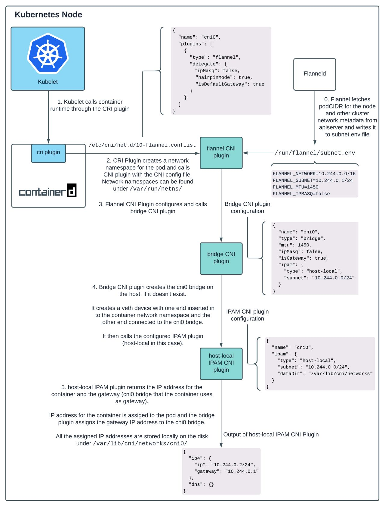

## 𝐊𝐮𝐛𝐞𝐫𝐧𝐞𝐭𝐞𝐬 Pod Netwoking : 𝐄2𝐄 𝐰𝐨𝐫𝐤𝐟𝐥𝐨𝐰 𝐨𝐟 𝐡𝐨𝐰 𝐚𝐧 𝐈𝐏 𝐚𝐝𝐝𝐫𝐞𝐬𝐬 𝐢𝐬 𝐚𝐬𝐬𝐢𝐠𝐧𝐞𝐝 𝐭𝐨 𝐚 𝐏𝐨𝐝 !!

**Explain how does a Pod gets an IP address within a k8s cluster?**  
The approach is a breakdown of multiple steps that involves interaction between 𝑲𝒖𝒃𝒆𝒍𝒆𝒕 <=> 𝑪𝑵𝑰 (Container Networking Interface) <=> 𝑪𝑹𝑰 (Container Runtime Interface)

- ✅ Kube-controller-manager assigns a podCIDR to each node in the cluster.
- ✅ Pods on a node are assigned an IP address from the subnet value in podCIDR.
- ✅ Because podCIDRs across all nodes are disjoint subnets, it allows assigning each pod a unique IP address.
- ✅ The k8s cluster administrator configures and installs kubelet, container runtime, network provider agent and distributes CNI plugins on each node.
- ✅ When a network provider agent starts, it generates a CNI config.
- ✅ When a pod is scheduled on a node, kubelet calls the CRI plugin to create the pod on the node assigned.
- ✅ The CNI plugin specified in the CNI config configures the pod network resulting in a pod getting an IP address !!

Link to know more - https://medium.com/google-cloud/understanding-kubernetes-networking-pods-7117dd28727
  

