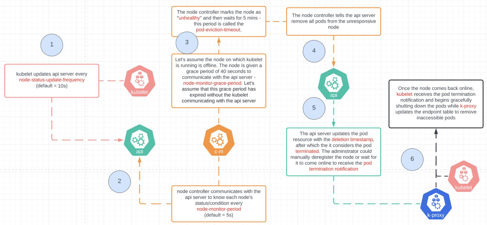

# 𝐔𝐧𝐝𝐞𝐫𝐬𝐭𝐚𝐧𝐝𝐢𝐧𝐠 𝐍𝐨𝐝𝐞 𝐒𝐭𝐚𝐭𝐞 𝐌𝐚𝐧𝐚𝐠𝐞𝐦𝐞𝐧𝐭 𝐢𝐧 𝐊𝐮𝐛𝐞𝐫𝐧𝐞𝐭𝐞𝐬

A common analysis while debugging any Kubernetes cluster involves understanding the 'Node' health that is seen on cluster events as 

👉 𝘕𝘰𝘥𝘦𝘏𝘢𝘴𝘚𝘶𝘧𝘧𝘪𝘤𝘪𝘦𝘯𝘵𝘔𝘦𝘮𝘰𝘳𝘺

👉 𝘕𝘰𝘥𝘦𝘏𝘢𝘴𝘚𝘶𝘧𝘧𝘪𝘤𝘪𝘦𝘯𝘵𝘗𝘐𝘋

👉 𝘕𝘰𝘥𝘦𝘙𝘦𝘢𝘥𝘺

👉 𝘐𝘯𝘷𝘢𝘭𝘪𝘥𝘋𝘪𝘴𝘬𝘊𝘢𝘱𝘢𝘤𝘪𝘵𝘺

If a node is found unhealthy, due to either 'DiskPressure' or 'MemoryPressure', then kubelet takes actions using four different node based timers
- Kubelet in each cluster node updates the api-server based on the frequency configured in the 𝐧𝐨𝐝𝐞-𝐬𝐭𝐚𝐭𝐮𝐬-𝐮𝐩𝐝𝐚𝐭𝐞-𝐟𝐫𝐞𝐪𝐮𝐞𝐧𝐜𝐲 parameter (default ~ 10s)
- Node controller checks time to time the node's status from the api-server using parameter 𝐧𝐨𝐝𝐞-𝐦𝐨𝐧𝐢𝐭𝐨𝐫-𝐩𝐞𝐫𝐢𝐨𝐝 (default ~ 5s)
- If node controller notices a node is unhealthy via 𝐧𝐨𝐝𝐞-𝐦𝐨𝐧𝐢𝐭𝐨𝐫-𝐠𝐫𝐚𝐜𝐞-𝐩𝐞𝐫𝐢𝐨𝐝 (default ~ 40s), it marks the node as 'unhealthy'
- Node controller waits for 𝐩𝐨𝐝-𝐞𝐯𝐢𝐜𝐭𝐢𝐨𝐧-𝐭𝐢𝐦𝐞𝐨𝐮𝐭, (default ~ 5 mins), updates api-server to remove the pod by setting 'terminate' state.
- Kube-proxy receives the pod termination notification from the api server.
- Kube proxy updates the endpoints by removing inaccessible pods.

