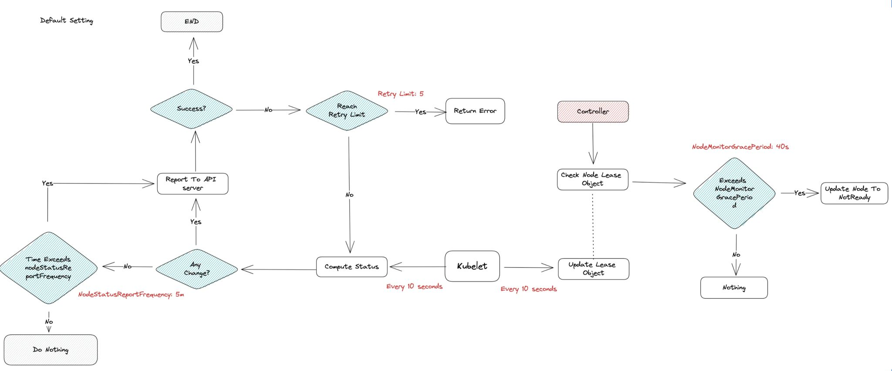

# 𝐖𝐡𝐚𝐭 𝐝𝐞𝐭𝐞𝐫𝐦𝐢𝐧𝐞𝐬 𝐢𝐟 𝐭𝐡𝐞 𝐊𝐮𝐛𝐞𝐫𝐧𝐞𝐭𝐞𝐬 𝐍𝐨𝐝𝐞𝐬 𝐚𝐫𝐞 𝐡𝐞𝐚𝐥𝐭𝐡𝐲

In a nutshell, Kubernetes checks that a kubelet has registered to the API server that matches the metadata.name field of the Node. If the node is healthy (i.e. all necessary services are running), then it is eligible to run a Pod. Otherwise, that node is ignored for any cluster activity until it becomes healthy.

Often during initial set-up or upgrades, there comes a situation whether Kuberenetes nodes report "Not Ready" or sometimes "Unknown" state. What does “ready” even mean for k8s nodes?

The kubelet on each node is tasked with sending the control plane, specifically the 𝒏𝒐𝒅𝒆-𝒍𝒊𝒇𝒆𝒄𝒚𝒄𝒍𝒆-𝒄𝒐𝒏𝒕𝒓𝒐𝒍𝒍𝒆𝒓, running a list of checks that determines:
➡ Whether the container runtime network is ready
➡ Whether the CSI provider on the node is ready
➡ Incomplete container runtime status check 
➡ Status of the Container runtime & pod lifecycle-event generator
➡ The node is shutting down 
➡ Missing CPU, memory, or max pods capacities

Based on the results, the node-lifecycle-controller takes this state and sets the node’s Ready condition to one of the following statuses:
✅ 𝑻𝒓𝒖𝒆 - The node is ready because all of the kubelet checks from the node came back green/healthy/no errors
✅ 𝑭𝒂𝒍𝒔𝒆- The node isn’t ready because one or more of the kubelet checks came back red/unhealthy/with errors
✅ 𝑼𝒏𝒌𝒏𝒐𝒘𝒏 - node-lifecycle-controller hasn’t heard from the node’s kubelet in node-monitor-grace-period time

