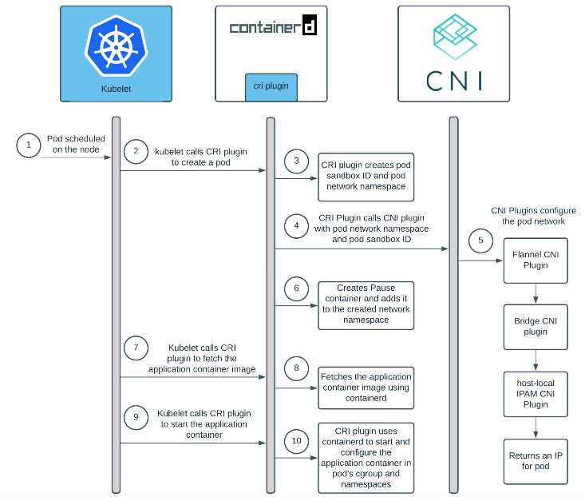

𝑲𝒖𝒃𝒆𝒍𝒆𝒕, 𝑪𝒐𝒏𝒕𝒂𝒊𝒏𝒆𝒓 𝑹𝒖𝒏𝒕𝒊𝒎𝒆 𝒂𝒏𝒅 𝑪𝑵𝑰 𝑷𝒍𝒖𝒈𝒊𝒏𝒔 - 𝒉𝒐𝒘 𝒕𝒉𝒆𝒚 𝒂𝒍𝒍 𝒔𝒕𝒊𝒕𝒄𝒉𝒆𝒅 𝒕𝒐𝒈𝒆𝒕𝒉𝒆𝒓 🤔 ☸ 

Kubernetes uses containerd as one of the CRI plugin to manage the full container lifecycle, importing OCI compliant images while the networking within pod is taken care by the k8s CNI plugin 

Let's understand what happens behind a pod creation :-

- Kubelet calls the cri plugin, via the CRI runtime service API, to create a pod

- CRI uses containerd internal to create and start a special pause container (the sandbox container) and put that container inside the pod’s cgroups and namespace 

- CRI configures the pod’s network namespace using CNI

- Kubelet subsequently calls the cri plugin, via the CRI image service API, to pull the application container image

- CRI further uses containerd to pull the image if the image is not present on the node.

- Kubelet then calls cri, via the CRI runtime service API, to create and start the application container inside the pod using the pulled container image

- CRI finally uses containerd internal to create the application container, puts it inside the pod’s cgroups and namespace, then to start the pod’s new application container. 

- After these steps, a pod and its corresponding application container is created and running.

Ref - https://github.com/containerd/cri/blob/v1.11.1/docs/architecture.md

